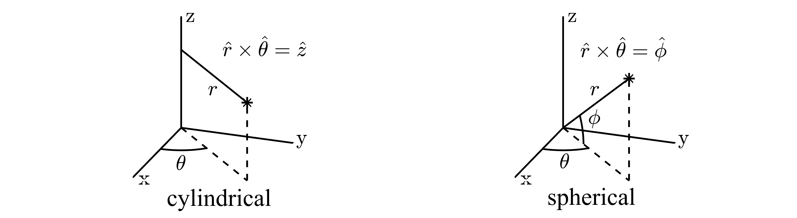

.. _theory-grid-cylindrical_rz:

1D Cylindrical and Spherical Geometries (axisymmetric)
=================

Coordinates
-------------

.. _fig-axisymmetric_coordinates:

   Cylindrical (left) and spherical (right) coordinate systems. The azimuthal angle :math:`\phi` is the same in both systems and ranges from :math:`0` to :math:`2\pi`. The elevation angle :math:`\theta` in the spherical system ranges from :math:`-\pi/2` to :math:`\pi/2`.

Jacobian
-------------

.. bibliography::
    :keyprefix: kp-
