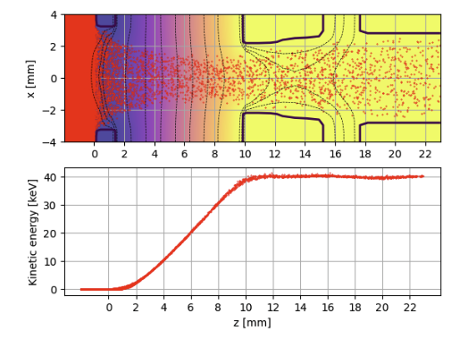

.. _examples-pierce-diode:

Ion-Beam Extraction from a Plasma Source
==========================================================

This test simulates the extraction of a high-energy (:math:`\sim 40\,\mathrm{keV}`) ion beam from a plasma source.
The volume of the simulation region is initially filled with a thermal plasma of positive Deuterium ions and electrons.
To maintain plasma density during extraction, additional ions and electrons are injected from the simulation box boundaries.
Without this boundary injection, the plasma would deplete as ions are accelerated out of the source region.
The ions are accelerated by a prescribed electrostatic potential set via embedded boundaries (EB), forming a focused ion beam with a target energy of approximately :math:`40\,\mathrm{keV}`
and a defined transverse geometry (e.g., single or multiple beamlets).

The purpose of this test is to verify that WarpX can correctly model ion beam extraction from a plasma source and subsequent electrostatic acceleration.

Plasma source and Beam Injection Setup
--------
Plasma source is set in two steps:

1) Initial plasma injection in the volume of the simulation box: plasma is filling the box with Deuterium ions and electrons of density :math:`1.22\times10^{18} \, \mathrm{m}^{-3}` and temperature :math:`10` eV, randomly distributed with a constant profile.

2) Boundary injection: Deuterium ions and electrons of the same density and temperature, injected from the simulation box boundaries -- from the :math:`\pm x`, :math:`\pm y` and  :math:`-z`.

A longitudinal electrostatic potential applied at the embedded-boundary surfaces defines the extraction voltage, accelerating ions from the plasma source to a target energy of :math:`\sim 40\,\mathrm{keV}`
and forming single (or multiple) beamlet(s) with a defined transverse spacing.

The figure below shows color map of the electrostatic potential (:math:`\phi`) overlaid with contours of the embedded boundary (eb_covered field) and ion (:math:`D^{+}`) macroparticles, as well as kinetic energy of the ion beam.

.. _ion_beam:

Run
---

This example can be run with the WarpX executable using an input file: ``warpx.3d inputs_test_3d_ion_beam_extraction``.
For `MPI-parallel <https://www.mpi-forum.org>`__ runs, prefix these lines with ``mpiexec -n 4 ...`` or ``srun -n 4 ...``, depending on the system.
Note: For the CI test, we intentionally specified very high values for `self_fields_absolute_tolerance` and `self_fields_required_precision`, and lowered spatial resolution to make the test run faster. For production runs, feel free to lower or increase these values accordingly.

.. literalinclude:: inputs_test_3d_ion_beam_extraction
   :language: none
   :caption: You can copy this file from ``Examples/Physics_applications/ion_beam_extraction/inputs_test_3d_ion_beam_extraction``.

Visualize
---------

To visualize the results, you can use the provided plotting script, which reads the output diagnostics in openpmd format and generates plots of the electrostatic potential, ion beam macroparticles, as well as ion beam energy distribution.
It also checks if particle energies tail is within relative tolerance of target energy of :math:`40\,\mathrm{keV}`.
